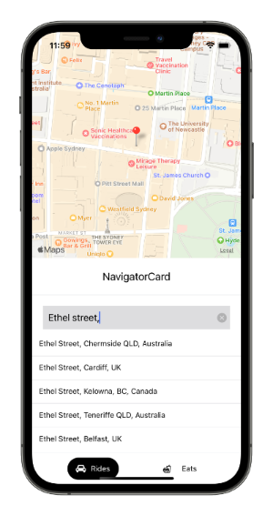

# MyTaxi

## Context: About MyTaxi

MyTaxi is an Uber inspired mobile application, where based on origin and destination information provided by user, will show markers and the path from origin to target.

## Tech stack

- React Native (Expo)  
- React Redux / Redux Toolkit  
- React Native Elements
- Google Maps Directions Api
- Google Maps Places API
- React Native Google Places Autocomplete
- Tailwind CSS (Twilwind React Native Classnames)

## Instruction: How to run, install and test

- Xcode and Android studio are required to run the app on your machine, or you can scan the QR code provided by Expo to launch on your iOS device.
- Clone the project by `git clone https://github.com/SirvanD/MyTaxi.git`  
- To install dependencies run `yarn`
- To run the application run `expo start`
- If you have Xcode installed, click option "Run on iOS simulator"
- You can also scan the QR code on your phone if your device is on the same network as your machine.

## Bugs and Future Work

- To design the ride options component
- Using Google Maps distance API, calculate the distance between A and B
- Calculate the Taxi fare

## App Screenshots

 

